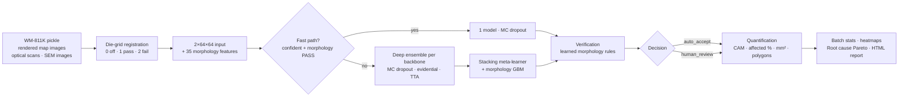

# WaferScan: architecture deep-dive

Every number on this page is **measured**: out-of-fold predictions on the dataset stated, reproducible with `make train stack export`. If a number couldn't be measured in the build environment (a GPU-only step), the page says so instead of estimating it.

---

## 1 · Data ingestion

| Source | Module | What happens |
|---|---|---|
| WM-811K `LSWMD.pkl` | `data/wm811k.py` | Loads the 2015 pandas pickle (aliases `pandas.indexes` for modern pandas). Parses the nested `[['Edge-Ring']]` labels, drops unlabelled wafers, caps `none` (147k) at 20k. **Groups = `lotName`.** |
| Rendered map images (the Roboflow set in `wafer_defect`) | `data/images.py::rendered_to_diemap` | Pixel colour → position on the viridis colour scale → die state. The die pitch is found from where colours change (a Fourier fit). The recovered grid redraws the original image with **97.3% median pixel agreement (worst 95.6%)**. |
| Full-wafer optical scans | `optical_to_diemap` | CLAHE only to *find* the wafer → ellipse fit → pure-stretch warp that undoes camera tilt → scribe-line pitch and phase (autocorrelation + sub-pixel Fourier refinement) → resample so every die sits on an exact integer grid → **die-to-die inspection**: each die interior is compared with the median of its neighbours (a local "golden die"). Output: die map + **per-die % of pixels affected**. |
| SEM review images | `sem_segment` | Background = heavy median blur; defect = what deviates from it. Outputs area in µm², polygon, circularity, elongation and a *shape hint* (particle / scratch / residue). The hint is a geometric heuristic, **not a trained SEM classifier**: there is no SEM training data. |
| Your own fab data | API `POST /api/v1/predict`, `/batch` | JSON die grid (`0/1/2`), optional real die size in mm, optional process-log rows for root cause. |

### The leakage audit (read this before trusting any wafer-map accuracy)
The rendered set has **6,309 images but only 4,162 independent wafers**. Two things cause this:
- Roboflow exported several augmented copies of each source file.
- Some wafers were rotated or flipped and saved under *new* names. For Near-full, 701 images come from only 278 wafers.

`data/build.py` finds renamed copies by fingerprint: the random fail speckle on a wafer is unique to it. Two maps are the same wafer if, after the best of the 8 rotations/flips, **both** their failed dies and their passing dies overlap by IoU ≥ 0.8.

Why both: plain "% of dies that agree" doesn't work. Two unrelated 90%-failed wafers agree on ~90% of dies by chance, and a first version of this audit fell for exactly that. On this dataset the score is cleanly bimodal: unrelated maps score < 0.6, copies score > 0.8.

**Measured effect of the leak** (same model, data and epochs; only the split changes): random image-level split **99.29%** vs grouped split **98.81%** on fold 0.

## 2 · Validation protocol
- **StratifiedGroupKFold (5 folds):** class proportions are kept, and a group (wafer, or lot for LSWMD) never straddles train and validation.
- **Out-of-fold (OOF):** every reported metric uses predictions from the fold model that never saw that wafer. Stacking, the Youden thresholds, the verifier and the auto-accept threshold are all fitted on OOF data too. The stacker has its own grouped CV (nested), so it is never scored on its own training rows.
- **No best-epoch picking:** training runs a fixed 12 epochs, which end exactly on a warm-restart cycle boundary. Choosing the "best epoch on validation" would quietly leak validation data into the reported score.

## 3 · Preprocessing
- **Die-grid registration (die maps):** crop to the wafer's bounding box, pad to a square (keeps a 1:1 die aspect), then `INTER_AREA` resize to 64×64. This averages when shrinking and acts like nearest-neighbour when enlarging, so a 26×26 and a 200×200 wafer become comparable inputs.
- **Input tensor:** 2 channels: *on-wafer mask* and *failed-die mask*.
- **Adaptive histogram equalisation (CLAHE):** applied to camera images for localisation. It is deliberately *not* used for the die-to-die comparison, because its local remapping made edge dies look defective (found by a test).
- **Radial/elliptical distortion:** ellipse fit → a symmetric stretch along the ellipse axes. There is no rotation, so die rows stay horizontal.
- **Polar representation** (`to_polar`): fail density on a radius × angle grid. Rotating the wafer is just a circular shift along the angle axis. The morphology features use it: edge coverage, ring detection.

## 4 · Augmentation and class balance
- **Random rotation (0–360°) + flips** on every draw. All 9 WM-811K classes are defined relative to the wafer's centre and edge, never by absolute angle, so a rotated Edge-Loc is still an Edge-Loc.
- **Minority oversampling** (`oversample_to`, GPU config: 1000): rare-class indices are repeated, and each repeat gets a fresh random rotation or flip, so every copy is a new, physically valid wafer. Pixel-space SMOTE is **not** used: blending two wafers invents blurry maps that no fab could produce.
- **Class-balanced loss weights** (Cui et al. 2019, effective number of samples, β=0.999 CPU / 0.9999 GPU). They are computed from the counts *after* the oversampling floor, so the two balancing tricks don't double-correct.

## 5 · Backbones

| Name | Params | Input | Role | Measured here |
|---|---|---|---|---|
| **WaferNet** (4 conv blocks + CBAM attention) | 0.54 M | 64×64 | default model, fast path, INT8 edge model | ✅ **99.16% OOF accuracy** |
| EfficientNet-B7 (timm) | 66 M | 224 (upsampled) | compound-scaled CNN | ⏳ GPU: `notebooks/train_gpu.ipynb` |
| SE-ResNeXt-101 32x8d (timm) | 49 M | 224 | ResNeXt-101 with squeeze-excitation channel attention | ⏳ GPU |
| Swin-T (timm) | 28 M | 224 | Vision Transformer with hierarchical patch merging and shifted windows | ⏳ GPU |

All four share one **ClassHead**: feature maps → global average pool → dropout → `fc` (softmax) and `evid` (evidential). That shape buys two things:
- **CAM heatmaps without gradients.** `Σ_k W[c,k]·F_k` is exactly the class activation map; a unit test proves `mean(CAM) + b = logits`. So heatmaps also come out of ONNX and TensorRT.
- **Cheap MC dropout.** Dropout sits on the pooled vector, so T stochastic predictions cost T small matrix products.

## 6 · Loss and optimiser (`configs/*.yaml`)
- **Focal loss with a γ schedule:** γ ramps linearly from 0 (plain cross-entropy, stable early learning) to 2 over the first half of training, so later epochs focus on hard wafers.
- **Label smoothing 0.1:** targets are 0.9 / 0.0125 instead of 1 / 0. This limits over-confidence, which helps calibration (ECE).
- **Evidential loss** (Sensoy et al. 2018) on the second head, weight 0.5, KL term annealed in over the first half.
- **Lookahead(AdamW)** (`timm`, k=6, α=0.5) + **CosineAnnealingWarmRestarts** (T₀=4, T_mult=2 → cycles end at epochs 4 and 12).
- Mixed precision (fp16 + GradScaler) and channels-last on CUDA.
- Checkpoint every epoch, and resume on restart.

## 7 · Uncertainty (three independent views)

| Method | What it measures | Where |
|---|---|---|
| MC dropout (30 samples, head-only) | epistemic: mutual information between samples | `policy.mc_dropout` |
| Deep ensemble (5 fold models × backbones) | disagreement between independently trained models | predictor, full path |
| Evidential (Dirichlet) | total evidence; `u = C / Σα` | `policy.dirichlet` |

*ponytail:* MC dropout is sampled on the head only, so it costs one backbone pass instead of T. If a calibration study shows the head-only version underestimates uncertainty, switch to full-network sampling.

## 8 · Ensemble strategy
- **Stacking with learned meta-weights:** a multinomial logistic regression over `[log p(each CNN, MC-mean), log p(morphology GBM), evidential u]`, trained on OOF predictions. Share of the learned weights: **wafernet 48%, morphology_gbm 39%, evidential_u 13%**.
- **Dynamic selection by input complexity:**
  - The **fast path** (one model) is accepted only if its confidence ≥ **0.991** and the morphology check passes. The threshold targets 99.8% accuracy for this single model.
  - Its probabilities are **temperature-scaled** first (T = 0.37). Label smoothing plus focal loss leave the raw CNN *under*confident: 99% right but only ~72% sure, ECE 0.276. One fitted number fixes that (ECE 0.0025) without changing a single prediction.
  - Result, cross-fitted: **86.8% of wafers take the fast path, at 99.78% accuracy.**
  - The other 832 wafers are where input complexity really lives: even the full ensemble is only 95.1% accurate on them. That's why the full path has its own, stricter threshold (§10).
  - Harder wafers go to the full ensemble, with 8-way rotation/flip TTA on request.

## 9 · Hierarchical verification (secondary morphological validation)
`features/morphology.py` computes 35 physical features in the spirit of Wu et al. 2015, the WM-811K paper:
- 13-region densities
- radial profile
- edge angular coverage
- geometry of the largest failed cluster: area, radius, elongation, solidity
- a Radon-projection line strength
- Moran's I

For each class, `fit_verifier` learns the 4 most distinctive features and their 1st–99th percentile range. A prediction whose own wafer falls outside that range gets a **WARN** (one feature out) or **FAIL** (two or more), with a plain-English reason. For example: *"fraction of the wafer edge that is failing = 0.08, but Edge-Ring wafers here show 0.31–1"*.

Cross-fitted OOF accuracy by verification status (fold k checked with rules learned on the other folds): PASS n=6121 acc=99.31%; WARN n=158 acc=95.57%; FAIL n=30 acc=96.67%. Flagged wafers are measurably less reliable, which is exactly what makes the flag useful for routing.

We also tested an automatic fix: "if the top class FAILs and the runner-up PASSes, switch to the runner-up". Cross-fitted, it did **not** improve accuracy, so it is switched off (`policy.json: auto_correct = false`) and FAILs go to a human instead. (Measured in-sample it looked helpful, which is exactly the trap cross-fitting exists to catch.)

## 10 · Decision policy: the honest version of "zero misclassification"
A model with no errors on real fab data does not exist: WM-811K's labels are themselves ambiguous at the Loc / Edge-Loc boundary. What production systems *can* guarantee is which wafers the model decides **alone**. In `auto` mode that decision is a two-stage cascade:

1. **Fast path:** accept if the calibrated single-model confidence ≥ 0.991 and verification PASSes (§8).
2. **Full path, for everything else:** accept only if the stacked confidence ≥ **0.991** and verification did not FAIL. This threshold is fitted on the wafers that actually *reach* this stage (the hard 832), targeting 99.5%. It accepts 439 of them, at 99.09%.

The whole cascade, cross-fitted (each fold judged by thresholds, rules and temperature learned on the other four, so results can land slightly under a target, as a real deployment would):

- **auto-accepted:** 93.8% of wafers, at **99.73%** accuracy
- **sent to human review:** 6.2% of wafers, containing 37 of the 53 errors (only 16 slip through)

A lesson from building this: the first version fitted the full-path threshold on *all* wafers. But in `auto` mode the full path only ever sees the hard ones, where its accuracy is far lower, so the model card promised more than the running system delivered. An independent review caught it by replaying the cascade exactly as the API runs it. Always evaluate the system you deploy, not its parts.

Want fewer errors? Trade automation for accuracy. `routing_oof.tradeoff` in the model card lists operating points; for example a 99.9% full-path target auto-accepts 93.0% of wafers at 99.76%. Setting the target is a fab decision, not a modelling one.

## 11 · Metrics (`evaluation/metrics.py`, stored in `model_bundle/model_card.json`)
- per-class precision, recall, F1 and support; macro, micro and weighted averages
- accuracy, balanced accuracy, top-2 accuracy
- Cohen's κ and Matthews correlation coefficient
- ECE (15 bins) plus reliability bins
- per-class one-vs-rest AUC and the per-class **Youden's J** alarm threshold
- a group-bootstrap 95% CI for accuracy and macro-F1 (resampling wafers, not images)

Stacked OOF results: **accuracy 99.21% (95% CI 98.90%–99.49%)**, macro-F1 0.9921, MCC 0.9911, κ 0.9911, top-2 99.97%, ECE 0.0030.

## 12 · Affected-area quantification (`inference/quantify.py`)
- **Pattern segmentation:**
  - A failed die is part of the pattern if it has ≥2 failed neighbours and its cluster overlaps the CAM hot zone, i.e. the network looked there.
  - Random and Near-full count every failed die; None counts none.
- **Outputs per wafer:**
  - fail % and pattern-affected % vs clean %
  - area in mm², centroid (die index, mm, normalised radius, angle)
  - polygon vertices on die corners, in die units and mm
  - 10-ring radial profile and 12-sector angular profile
  - Moran's I, cluster counts
  - a smoothed fail-density heatmap
  - the list of failed dies with x/y in mm
- **Per die:** with optical scans, the % of the die's pixels that deviate from the golden die.
- **Per batch:** pooled rate with Wilson CI, wafer-mean with t-CI, batch density heatmap, radial profile.
- **Units:** mm² needs a die size. Without one it is estimated from the wafer diameter (default 300 mm) minus edge exclusion, divided by the dies across. The response says which was used.
- **Uncertainty, labelled honestly:**
  - `wilson95` treats dies as independent trials (optimistic for clustered fails).
  - `segmentation_range` re-segments with stricter and looser settings. That is the real uncertainty of an *area*.

## 13 · Root-cause inference (`inference/rootcause.py`, `configs/rootcause_kb.yaml`)
- **Priors:** P(cause | defect class) from textbook associations, for example:
  - Edge-Ring ← etch edge-ring wear / EBR / deposition edge roll-off
  - Scratch ← CMP pad wear / handling
  - Center ← deposition temperature / CMP zone pressure / spin coat

  These are editable YAML, not ground truth.
- **Evidence from process logs,** every test against clean wafers, with Benjamini–Hochberg FDR control:
  - parameter shifts: Mann–Whitney U + standardised difference
  - equipment matching: χ² + per-chamber rate ratio
  - temporal drift: binomial likelihood-ratio changepoint, p-value by shuffling the wafer order; overall and per chamber
  - consumables: class rate by counter quartile + point-biserial r
  - class transitions on the same equipment
- **Score:** `P(cause | class, data) ∝ prior × exp(strongest significant evidence)`. The batch contribution weights each class by its frequency. The Pareto list and cumulative line come with a drill-down of the evidence behind each cause.
- **Validated** on a simulated fab with planted causes. The chamber-B focus-ring wear, CMP pad ageing and deposition-temperature excursions each come out top for their class, with the chamber-B drift onset found. On a stationary simulated line it reports no drift and no chamber effect (`tests/test_logic.py`).
- **Associations, not proof:** confirm with process engineering or a DOE.

## 14 · Serving
- **FastAPI, async:** CPU work runs in a thread pool. OpenAPI spec at `/docs` and `docs/openapi.json`.

| Endpoint | Purpose |
|---|---|
| `GET /api/v1/health` · `/model/card` · `/stats` | ops; every OOF metric; recent latencies |
| `POST /api/v1/predict` | die grid → class, probabilities, uncertainty, verification, decision, CAM, quantification |
| `POST /api/v1/predict/image` | rendered map / optical scan / SEM image upload (`kind=auto` detects rendered maps) |
| `POST /api/v1/batch` | up to 256 wafers (+ optional process logs → root cause) → batch stats, `report_url` |
| `GET /api/v1/batch/{id}/report` | self-contained HTML report in the landing page's monochrome style |
| `POST /api/v1/rootcause` · `/rootcause/csv` · `GET /rootcause/demo` | root-cause Pareto |
| `GET /api/v1/samples[/{i}]` | demo wafers for the landing page (fold-0 validation set: unseen by the fast model) |

- **Backends:** local ONNX Runtime (CPU or CUDA), or **Triton** over the KServe v2 HTTP protocol. The Triton client is tested against a mock v2 server wrapping the real ONNX models; it gives the same class and confidence to 1e-5.
- **Exports** (`export/onnx_export.py`):
  - `ensemble.onnx`: the K fold models in one graph
  - `fast.onnx`
  - `edge_int8.onnx`: static QDQ INT8 for offline fab-floor stations; **98.73% vs 98.81% FP32** on fold-0 validation, 3.3× smaller

  ONNX-vs-PyTorch parity: max |Δ| 1.5e-05.
- **Latency on this 2-core CPU, batch 1:**

  | Stage | p50 |
  |---|---|
  | Fast model | 1.8 ms |
  | INT8 model | 1.5 ms |
  | 5-model ensemble | 9.1 ms |
  | Whole `/predict` request, including quantification | 11 ms |
  | 4096×4096 optical scan → die map (image to die grid) | 2243 ms |

- **TensorRT** (`deploy/tensorrt/build_engines.sh`): FP16 engines with dynamic batch 1–64. They're built **on the GPU node**, because an engine built on a T4 won't load on an A10G. The "sub-50 ms at 4K" target is therefore **not measured here** (no GPU). The CPU numbers above are the floor it has to beat.

## 15 · Deployment
- **Images:**
  - `Dockerfile` (repo root): the API image. CPU, ONNX Runtime, no PyTorch, non-root, one worker, small-host defaults
  - `Dockerfile.train`: CUDA PyTorch
  - `Dockerfile.mlflow`
  - `deploy/triton/Dockerfile`
- **Compose:** API + MLflow; the `gpu` profile adds Triton and a Triton-backed API.
- **Kubernetes** (`deploy/k8s`, `kubectl apply -k`):
  - **API:** Deployment (2–10 replicas via HPA, spread across nodes, read-only root filesystem), PDB, Ingress with a 20 MB body limit.
  - **Triton:** required node affinity `nvidia.com/gpu.present=true` (the GPU Feature Discovery label), a preference for L4 / A10G / T4, a toleration for the `nvidia.com/gpu` taint, `nvidia.com/gpu: 1`. Two initContainers build the TensorRT engines on that node before serving.
  - **MLflow:** server with a PVC; `--allowed-hosts` is required by MLflow 3 and tested.
  - **Training:** a GPU **Job** with the same affinity. Checkpoints on the PVC mean a preempted pod resumes.

## 16 · What was verified in the build environment (2-core CPU, no GPU)

| Verified here | Not verifiable here |
|---|---|
| die-map recovery, leakage audit, 5-fold grouped training, stacking, all metrics, verification, routing | EfficientNet-B7 / SE-ResNeXt-101 / Swin *training results* (code path shared with WaferNet; run the notebook) |
| ONNX export + parity, INT8 accuracy/latency, API end-to-end, Triton protocol client vs mock v2 server | Triton server itself, TensorRT engine build, GPU latency |
| optical die-to-die inspection and SEM measurement on synthetic scans with known answers | real optical/SEM images (none available) |
| root cause on a simulated fab with planted causes | real process logs |
| YAML/JSON validity of k8s/Triton configs, MLflow `--allowed-hosts` behaviour | `kubectl apply` against a real cluster |
